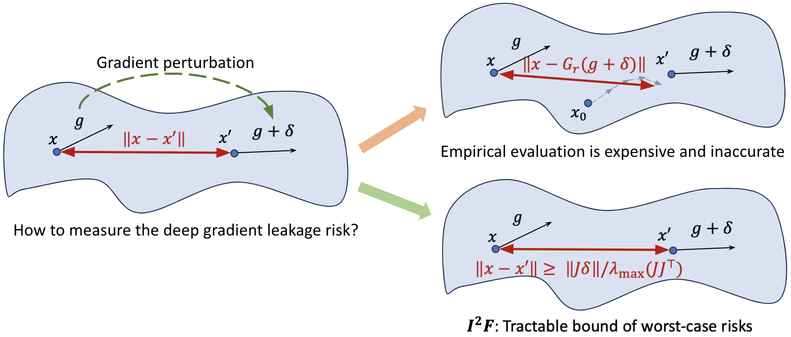

Understanding Deep Gradient Leakage via Inversion Influence Functions
====================================================

[](https://opensource.org/licenses/MIT)

Official PyTorch Code for Paper: "Understanding Deep Gradient Leakage via Inversion
Influence Functions" Haobo Zhang, [Junyuan Hong](https://jyhong.gitlab.io/), [Yuyang Deng](https://sites.psu.edu/yuyangdeng/),
[Mehrdad Mahdavi](https://www.cse.psu.edu/~mzm616/) and [Jiayu Zhou](https://jiayuzhou.github.io/), *NeurIPS* 2023.

[paper](https://arxiv.org/pdf/2309.13016.pdf) / [code](https://github.com/haobozhang/inversion-influence-function) / [blog](https://jyhong.gitlab.io/publication/2023neurips_i2f/)

## Overview


<!--  -->


Deep Gradient Leakage (DGL) is a highly effective attack that recovers private training images from gradient vectors. This attack casts significant privacy challenges on distributed learning from clients with sensitive data, where clients are required to share gradients. Defending against such attacks requires but lacks an understanding of when and how privacy leakage happens, mostly because of the black-box nature of deep networks. In this paper, we propose a novel Inversion Influence Function ($I^2F$) that establishes a closed-form connection between the recovered images and the private gradients by implicitly solving the DGL problem. Compared to directly solving DGL, $I^2F$ is scalable for analyzing deep networks, requiring only oracle access to gradients and Jacobian-vector products. We empirically demonstrate that $I^2F$ effectively approximated the DGL generally on different model architectures, datasets, attack implementations, and noise-based defenses. With this novel tool, we provide insights into effective gradient perturbation directions, the unfairness of privacy protection, and privacy-preferred model initialization. Our codes are provided in https://github.com/illidanlab/inversion-influence-function.

## Estimate DGL risks by I2F

To calculate $I^2F$ or its lower bound (as defined in Eq. 4 and Eq. 5 in the paper, respectively), use the function `compute_exact_bound()` or `I2F_lb()` in `./utils.py`. Please check `./demo.py` for an example about how to use the function.
```python
import torch
from utils import I2F_lb
# get model, images, labels
noise = [1e-2 * torch.randn_like(p) for p in model.parameters()]
estimated_DGL_risk = I2F_lb(model, images, labels, noise)
```

*Note you don't need to really run the inversion process. Just input your model, data, and noise into the function, then you can easily get* $I^2F$ *or its lower bound.*

## Package dependencies

Use `conda env create -f environment.yml` to create a conda env and
activate by `conda activate I2F`. Major dependencies include
`pytorch, torchvision, wandb, numpy, lpips`.

## Demos
Here we provide several demos of results in the paper.
You can change the arguments `model` and `dataset` to plot the RMSE vs. I2F_lb curve for different models and datasets.

- **I2F with Gaussian noise:**

    - Run `python3 ./demos/codes/bound_I2F.py --baseline run --model ResNet18 --dataset cifar10`.

- **I2F with gradient pruning (Fig. 13 in the paper):**

    - Use wandb to sweep `./sweeps/bound-pruning.yaml`.

- **Inversion with different eigen vectors as the gradient noise (Fig.5 in the paper):**

    - Run `python3 ./demos/codes/invert_eigen_vectors.py --baseline run --model ResNet18 --dataset cifar10`.

- **I2F with different model initializations (Fig. 7 in the paper):**

    - Use wandb to sweep `./sweeps/invert-initilization.yaml`.

- **The effect of different $\epsilon$ (Sec. 4 in the paper):**

    - Use wandb to sweep `./sweeps/tune-epsilon.yaml`.

Some sample output log files are provided in `./demos/output/` with the corresponding hyperparams. A line of sample output is `JtDelta: 0.01304 | MaxEigenValue: 2.716 | MSE: 0.0002234 | vgg: 0.01557 | SSIM: 0.9932`

## Acknowledgement
This research was supported by the National Science Foundation (IIS-2212174, IIS-1749940), National Institute of Aging (IRF1AG072449), and the Office of Naval Research (N00014- 20-1-2382).
